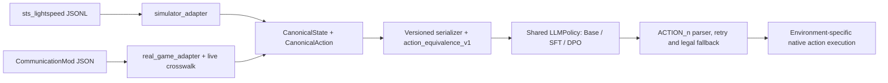

# Runtime and simulator

This document is the maintained operational description of the local runtime,
the simulator boundary, and real-game validation. Retained experiment and
mechanics evidence lives in `report/`. Historical source identifiers do not
imply that a release snapshot includes the original execution implementation.

Asset identities and resume compatibility are described in the
[validation contract](data_training.md#asset-validation-and-compatibility).

Read by boundary: [native environment](#callable-native-environment-selection),
[frozen evaluation](#frozen-policy-evaluation-inputs-and-reuse),
[simulator](#simulator-contract), [real game](#real-game-boundary),
[policy compatibility](#shared-policy-boundary-and-historical-compatibility),
[input generation](#combat-input-generation), and [commands](#maintained-commands).

## Locked components

- Python is managed with `uv`; project commands use `uv run python ...`.
- Current offline V7 experiments use
  `Qwen/Qwen2.5-7B-Instruct@a09a35458c702b33eeacc393d103063234e8bc28`.
- The real-game default retains
  `Qwen/Qwen2.5-1.5B-Instruct@989aa7980e4cf806f80c7fef2b1adb7bc71aa306`
  with its Gold SFT V5 adapter.
- The native simulator is `sts_lightspeed` at
  `7476a81954020087da31d41d16fddf475746ec2d` and is built below
  `.simulator/`, outside the Python environment.
- Model artifacts live below `.model-cache/`; raw evidence and run outputs live
  below `data/raw/` and `outputs/`. These directories are ignored but are not
  disposable caches.

Model/tokenizer identities and decoding settings are defined separately by
`configs/runtime/base_model_runtime_7b_v2.json` and the retained 1.5B
`configs/runtime/base_model_runtime_1_5b_v2.json`. External inputs needed beyond a Git
checkout are listed in the [asset requirements](../../README.md#assets-and-reproduction).

### Execution requirements and recorded hardware

Current 1.5B and 7B entry points use `base_model_runtime_v2`. Execution profiles
are separate from model identity: training/evaluation configs supply one explicitly;
the 1.5B runtime also names its default profile for standalone live use. An explicit
profile takes precedence over that default. The shared
[`training_cuda_bf16.json`](../../configs/runtime/training_cuda_bf16.json) requires a
CUDA build of PyTorch and native BF16 support on the selected device. It does not
require a GPU product name, compute-capability whitelist, CUDA minor version or
Linux. Native simulator builds retain their separate Windows/Linux x86-64 boundary.

`model_loading.device` accepts `cuda:N` and controls both model and input placement.
BF16/SDPA, unquantized weights and the existing decoding rules remain required;
CPU, ROCm, multi-device sharding and automatic precision fallback are not supported.
Memory sufficiency is established by the intended run's loading/backward check,
not by a product-name or fixed-memory-size gate. Different hardware can produce
different floating-point results; hardware independence does not promise bitwise
identical retraining or trajectories.

The V2 execution profile uses version specifiers. Python follows the package's
`>=3.11` requirement; the model libraries retain their recorded release versions.
PyTorch CUDA build suffixes are not compared as experiment requirements. `uv.lock`
and the cu132 wheel source retain a concrete installation environment. If choosing
another compatible PyTorch build, install it explicitly and use `uv run --no-sync`
to avoid restoring the locked build; repeat readiness on that environment.
The profile is an admissibility check, not evidence that every admitted environment
has been tested. Historical V1 profiles retain their strict matching semantics.

Recorded local 1.5B validation used an RTX 5060; the continuous 7B training reports
record an RTX 5090 D, Python 3.11.14, PyTorch 2.12.1+cu132 and CUDA runtime 13.2.
These are experimental observations, not required hardware. See the
[local preflight](../../report/training/expanded_sft_backward_preflight_v3.json)
and [7B training record](../../report/training/qwen2_5_7b_gold_sft_v7_v1.json).

### Native platform builds

Windows retains the original `configs/env/sts_lightspeed_build.json`,
`.simulator/sts_lightspeed/` artifacts and manifest. Linux selects the separate
`configs/env/sts_lightspeed_build_linux.json` by default and writes only below
`.simulator/sts_lightspeed-linux/`; it never rebinds the Windows hashes. The
Linux bridge is built from the current tracked source and declares
`combat_card_selection_v1` in both config and manifest. Build configs and manifests
declare `mechanics`: `legacy_v1` for the Windows base and `corrected_v1` for Linux
and the Windows extension. Corrected execution verifies the bound bridge and
mechanics patches even when secondary selection is disabled.

### Native build prerequisites

Both supported hosts need Git, network access to the pinned upstream source and
submodules for the first build, and a C++17-capable `g++` on PATH:

| Host | Build tools |
| --- | --- |
| Windows x86-64 | A native Windows x86-64 GCC/MinGW toolchain with static GCC/C++ runtime libraries; `pwsh` or `powershell` available for the existing builders. Git Bash supplies the shell for Bash experiment blocks; it does not itself supply the required compiler. |
| Linux x86-64 | `g++` with its C++ headers, static GCC/C++ runtime libraries and pthread support; Bash for the experiment blocks. |

The build entry invokes these tools directly. Python dependency installation
does not install a C++ toolchain. GPU requirements apply to model execution,
not to native compilation or Teacher-only search.

## Callable native environment selection

`resolve_simulator()` is the shared entry for native platform selection, build
dispatch, capability validation, and client/environment creation. It detects the
OS and CPU architecture of the **executing process**. Supported profiles are
Windows x86-64 and Linux x86-64. An explicit target
must match that host; unsupported systems, architectures, and capabilities fail
with a diagnostic. No model, dtype, dataset, Teacher profile, or experiment
configuration is selected by this layer.

Import runtime interfaces from their defining modules. The `env` package does
not re-export simulator classes or serializer constants; importing a state or
observation module does not load the simulator runtime.

```python
from sts1_llm_policy.env.simulator_execution import resolve_simulator

execution = resolve_simulator(
    target="auto",
    mechanics="corrected_v1",
    required_capabilities={"combat_card_selection_v1"},
)
installation = execution.validate()  # Hash checks; no build or process launch.
environment = execution.create_environment()
# Run the existing environment API, then close the environment.
environment.close()
```

Validation is reused by clients and environments from the same execution object.
Resolve a new object after externally changing the installation; `build()` clears
the saved validation before inspecting or building artifacts. This reuse is local
to the object, not a persistent asset cache.

The default `mechanics="corrected_v1"` uses the Windows extension or the Linux
build. `required_capabilities={SELECTION}` independently enables secondary
selection in `create_environment()`; omitting it preserves the V5 single-action
boundary on the same corrected binary. Explicit `mechanics="legacy_v1"` supports
only the existing Windows base without selection; Linux legacy and unknown
mechanics fail rather than fall back. No Linux legacy build is maintained.
Low-level `discover_sts_lightspeed()` and the client without an explicit installation
retain platform-base discovery for historical callers; maintained single evaluation
and panel generation use the shared resolver with an explicit mechanics requirement.
Platform filenames and native build commands are confined to the profile layer;
the PowerShell and Linux Python builders remain compatibility implementations.

After installing the [build prerequisites](#native-build-prerequisites), build
from the project root in PowerShell or Bash:

```text
uv run --locked python scripts/simulator.py build --require combat_card_selection_v1
```

This validates the installation and runs the bounded native protocol smoke.
A subsequent `verify` or `smoke` is unnecessary unless diagnosing a change.
Use `resolve` to inspect platform/profile selection without an installed binary;
use `verify` to inspect existing bindings without launching the native process.
All actions default to corrected mechanics. `--mechanics legacy_v1`
explicitly selects the Windows historical base. Old manifests without a mechanics
declaration are rejected. Rebuild using the platform builders: on Windows run
`scripts/build_sts_lightspeed.ps1` followed by `scripts/build_card_selection_bridge.ps1`;
on Linux run `uv run --locked python scripts/build_sts_lightspeed_linux.py`.
Do not relabel old manifests to bypass validation. These are explicit rebuilds;
the shared `build` command still refuses to overwrite an invalid retained binding.
Both platforms validate the recorded Teacher search and card-exhaust patches
against the current checkout. The Windows extension also records its own
card-exhaust patch hash and checks the base patch bindings before writing outputs.
An older extension missing that record requires an explicit extension rebuild;
changed or missing base patch bindings require rebuilding the base first.
Direct platform builders reuse the pinned checkout and recompile; allow the fresh
build budget below. Ctrl+C can leave partial objects; there is no object-level
resume contract. After a successful direct rebuild, use `simulator.py build` to
validate the selected installation and its current bounded protocol checks.

The project root is the current checkout. `--target windows|linux` makes the target
explicit;
`--report outputs/platform-adaptation/<new-name>.json` saves a new resolution or
verification report and refuses to overwrite an existing report. Reports include
the selected profile, mechanics, architecture, required capabilities, config fingerprint,
native commands, and, after verification, selected artifact and manifest hashes.
`resolved` means the profile was selected; `ready` means its installed bindings
passed validation, not that a new simulator-quality evaluation was performed.

Resolution, verification, and a build against a valid existing installation
normally take 1–3 seconds (rough estimate; local verification measured below one
second). `build` constructs only missing artifacts and otherwise validates the
existing installation. A fresh Linux build previously measured 158.89 seconds;
allow 2–4 minutes depending on network/compiler load. A missing Windows selection
extension previously measured 10.85 seconds; allow 10–30 seconds. A fresh Windows
base build has no estimate from this acceptance; allow several minutes as a rough
estimate. Builders report clone/compilation/smoke progress; final JSON status
`ready` is the success signal. `--skip-smoke` is an explicit build-only testing
option and does not claim smoke acceptance.

Build outputs stay in the selected `.simulator/` root and, for Windows selection,
`outputs/card-selection/`, using the existing build configs. Ctrl+C stops a build;
there is no partial-object resume contract. Rerun after an interruption only if
no unbound binaries remain. Existing invalid manifests or unbound binaries cause
an error requiring inspection/recovery, rather than an automatic overwrite.

The adaptation tests cover both profile choices, explicit-target mismatch,
unsupported capabilities/architectures, retained raw-byte hash checks, missing
build dispatch and valid-build reuse. Native selection tests exercise the shared
factory on the host on which they run. Fresh compilation is tested through
dispatch fixtures here; the builders produce only the bridge. `simulator.py build` runs the same bounded
bridge protocol smoke as `simulator.py smoke`; `--skip-smoke` omits that check.
Upstream console and full-game test executables are not installation requirements.

### Checkout and byte identity

Install the virtual environment and native binaries for the current platform.
Supply model snapshots, datasets and checkpoints at their declared paths and
validate their content bindings. Git or a source snapshot provides code and
configuration; it does not supply or certify those external assets.

`.gitattributes` pins LF for adaptation and portable execution inputs, and for the
tracked files used by the live runtime: mechanics and V5 catalogs, the 1.5B
runtime, SFT recipe, and the live policy's training config and report. These rules
preserve the existing hashes across Git checkout and source archive export,
including with `core.autocrlf=true`; they do not change report contents or expected
digests. Other historical native source working-copy bytes and build manifests
are not normalized or rebound.
The existing selection manifests hash raw source bytes: LF and CRLF remain
different byte identities even at the same Git commit. Each platform validates
against its own build manifest; cross-host source provenance uses the Git revision
while artifact integrity uses that host's manifest. Do not compare Windows and
Linux executable hashes as an equivalence test.

### Training readiness on the current machine

Before training, check the selected model, dataset, recipe and execution profile
on the machine that will run the experiment. From the project root:

```text
uv run --locked python scripts/restore_training.py --config configs/runs/training/single_qwen2_5_7b_gold_sft.json
```

The config selects the 7B SFT inputs. Use the intended training config for its own
readiness check. `--expected-commit` can additionally enforce a specific revision
in a Git checkout. Estimated time is **roughly 2–8 minutes** for initial 7B
readiness, depending on disk speed, tokenization, GPU and memory; no formal
training is started. A successful historical check does not establish readiness
of a different machine, environment or input set.

Recovery verifies Git cleanliness, the train-only dataset and existing asset
bindings, the actual execution environment, and any latest resume checkpoint.
It loads the model once and always executes a short greedy generation on the
longest training prompt. It also executes longest-sample backward without an
optimizer unless `--previous <recovery-report>` supplies a passed result with
matching model, recipe, data, implementation, seed, execution profile and actual
environment. A changed GPU name, memory size, driver or software environment
therefore triggers backward again. Checking driver identity requires working
`nvidia-smi`.

Only a task declaring `required_simulator_capabilities` checks the simulator:
existing installation/hash validation and one native protocol handshake, without
rebuilding or running the historical matrix. The current 7B SFT task needs none.
No test/sealed data or full historical test matrix is read/run by recovery.

One result is saved below `outputs/recovery/`, or to a new `--report` path.
Progress names the stage; final `status: ready` is the success signal. The result
distinguishes checks executed now from backward evidence reused from a prior
report. A GPU/probe failure saves `failed`; configuration/data-preflight failures
print the missing or conflicting input before model loading. Ctrl+C stops the
check; rerun the same command (choose a new explicit report path if one was
already written). Recovery does not alter checkpoint state or overwrite evidence.

The opt-in `training_run_v2` uses a `base_model_runtime_v2` for model/tokenizer,
precision and generation semantics, plus a separate execution profile. Current
profiles follow the [execution requirements](#execution-requirements-and-recorded-hardware)
above. A changed device or environment requires fresh readiness evidence; there
is no automatic precision, batch-size or recipe adjustment.

The [configuration contract](data_training.md#configuration-and-artifact-reuse-direction)
defines generated identities, snapshots and the V1/V2 compatibility boundary.
Portable formal SFT/DPO uses `run_training.py --recovery-report <passed-report>`;
execution history is retained in checkpoints/results when training continues.
V2 supports both algorithms with explicit `initial_checkpoint` for DPO.
Each config derives `outputs/training/<run_id>/`; recovery results remain below
`outputs/recovery/`. Readiness establishes that this configuration can execute;
it does not update the model-family default or claim a trained policy.

## Frozen policy evaluation inputs and reuse

`scripts/run_frozen_policy_panel_evaluation.py` requires `--config` and delegates
to `eval/frozen_policy_panel.py`. It checks the frozen panel's content
fingerprint, snapshot consistency, counts and observation version. Its config no
longer binds runtime, execution or panel JSON files by byte hash.
Observation semantics are selected directly by `observation_version`; the runner
enforces its V5 boundary without loading a separate observation JSON contract.
Previously prepared configs with `observation_contract` must be regenerated using
the current experiment preparation entry; the retired field is rejected.
The config requires `simulator_mechanics` (`corrected_v1` or Windows-only
`legacy_v1`), independently of V5 observation and actions. The current three
single configs use corrected mechanics and new `*-boss-corrected-v1` output
directories. Their frozen input snapshots and reference adapters are unchanged;
results are new evaluations under corrected rules, not reproductions of the
historical victories. Missing mechanics fields in old prepared configs are rejected.
The `frozen_policy_panel_binding_v4` resume identity uses resolved model assets,
tokenizer and decoding settings, dependency versions, panel identity, simulator
revision, mechanics and bridge content, observation/action versions and the decision limit. Config formatting,
file locations, output paths and acceptance bookkeeping do not invalidate it.
Execution requirements are still checked by the model loader; resolved execution
requirements and the run config are recorded in the final report. Old episode
bindings are rejected without rewriting their evidence.

The optional `checkpoint` selects a project-relative adapter directory; omission
selects Base. Preflight validates adapter/Base compatibility and weight identity,
and the backend loads that same adapter. Adapter content is part of resume
identity; moving it without changing content preserves identity. Existing episode
bindings are reused only when all resolved fields match. Switching from a historical
exact-version profile to the current version-specifier profile changes that binding;
use a new output directory, without re-signing historical episodes.
Arm/purpose names and panel counts are supplied
by the config; the engine does not require 7B, 192 combats, or Act 1/A0. The
supported observation/action contract remains V5 single-action development data.

Formal execution writes `report.json`, per-combat resumable files, and a compact
`episodes.jsonl` containing the original episode summaries and their bindings in
declared panel order. Use the report and JSONL together for aggregate and
paired-combat analysis. Resume requires the original step trajectories: their hashes,
episode identities, terminal outcomes and recomputed summaries must match the saved
episodes. Missing or inconsistent evidence is rejected. Ctrl+C interrupts; rerunning the same config checks completed
combats and executes only missing ones. Changed candidate/input bindings are
rejected, so use a new output directory for a different experiment.

The Transformers backend checks model metadata through the tokenizer loader once
per startup. Weight, tokenizer asset and loaded-tokenizer checks remain in place.
Generator output verification remains a separate contract below.

Stage-specific training/evaluation commands are in
[single](experiments/single.md#running-the-7b-comparison); continuous configuration
selection is in [continuous](experiments/continuous.md#training-and-evaluation).

## Simulator contract

The native process exposes a JSONL request/response protocol. Python validates
the installation, converts raw simulator states and legal actions to the same
canonical boundary used by the real-game adapter, and rejects stale or illegal
actions. A combat has an explicit terminal outcome and HP accounting.

`supported_mechanics_v1` is the real-game parity boundary. It covers the P0
starter-deck Cultist, Jaw Worm, and Two Louse benchmark. The tracked parity
report records 42/42 matching executable transitions across the three required
encounters. Expanded cards, dynamic decks, and four additional encounters are
simulator-only development scope and do not widen that real-game claim.

The maintained simulator development scope supports seven encounters, three
fixed loadouts, and deterministic 12/16/18-card feature decks. Every reset
submits a validated full deck specification before native shuffle and draw.
Model-visible observations never include native action IDs, card UUIDs, future
RNG, or hidden draw order.

Privileged search also exposes an opt-in
`visit_every_root_edge_before_ucb_v1` coverage mode. It visits every legal root
edge once before ordinary UCB allocation, preventing the shifted min-max score
from starving an unvisited action. The option is disabled by default so retained
historical Teacher trajectories preserve their original search semantics.

For allocation-sensitive audits, privileged search also accepts an opt-in
`minimum_root_action_visits`. The bridge cycles over root edges until each has
the requested count, then returns to ordinary UCB. It rejects requests whose
simulation budget cannot satisfy the minimum for every native root edge and
reports both the effective minimum and
`minimum_root_edge_visits_before_ucb_v1`. A zero value retains legacy behavior;
the older boolean coverage option remains compatible and maps to one visit.

## Real-game boundary

The executable operator procedure, rolling session status, troubleshooting,
and open live-test limitations are maintained in
[`real_game_testing.md`](real_game_testing.md).

CommunicationMod is used only for selected integration and parity captures.
BaseMod developer commands are an operator control plane and never enter policy
observations or legal action sets. Real evidence is classified as
`parity_clean`, `mechanic_probe`, or `coverage_collection`; only validated
`parity_clean` fixtures count toward the P0 parity denominator.

`real_game_p0_clean_capture_v1.json` is the separate clean-capture/parity profile
used by `run_random_combat.py`; it remains distinct from the live policy sessions.

The configured Gold-SFT-V5 session is an exploratory operator-in-the-loop
interface, not a parity or policy-quality claim. CommunicationMod launches it
as its configured child process; running it in a separate terminal does not
connect its stdin/stdout protocol to the game. It performs one handshake,
waits through the launch-time main menu, controls combat decisions only, and
waits for the operator to handle rewards, card choices, shops, events, rest
sites, and routes. During that wait it may issue only the read-only `state`
request. Every combat is fsync-logged to a separate trajectory, while an
atomically replaced session report records entry HP, Act/floor, encounter,
deck/relic identity, outcome, and safe-stop status. Unsupported observation
mechanics stop the session before a command is issued for that decision. Live
records are marked `coverage_collection` and are not automatically eligible
for training. CommunicationMod relic display IDs are normalized to the same
canonical IDs used by the frozen simulator catalog.

The live session's `mechanics_fallback` is explicitly configured as
`communication_mod_descriptions_with_audited_powers_v2`. Frozen project
descriptions remain the first choice so known states match the training
observation. An otherwise
unknown card or relic may use its nonempty CommunicationMod description after
whitespace normalization; the selected mode is recorded in the session report
and every trajectory transition. The fallback also carries an audited live-only
description for base-game `Split`, whose power payload contains no description.
Missing descriptions and unaudited power IDs still fail closed.
Power IDs pass through the versioned
`communication_mod_to_sts_lightspeed_v7` namespace crosswalk before lookup.
Formatting-only differences are reconciled against the complete current power
catalog, while the small set of genuinely different runtime IDs is explicit
(`Anger`, `Confusion`, `Flex`, and `Weakened`). This follows CommunicationMod's upstream
contract: it forwards `power.ID`, `card.cardID`, and `relic.relicId`; it does not
publish a separate mechanics registry or general power descriptions. Unknown
powers, monster moves, and behavior rules therefore remain fail-closed because
the current payload does not provide their complete semantics. The same
crosswalk projects audited base-game monster IDs and native `nextMove` byte
orderings onto the canonical sts_lightspeed catalog; both current and previous
move IDs are projected before behavior construction. The audited exceptions
cover Sentry, The Guardian, Gremlin Fat, Lagavulin, small Acid Slime, Bronze
Orb, Slime Boss, Taskmaster, and The Collector, plus the native IDs used for
Mystic, Shelled Parasite, Taskmaster, and The Champ. Native intent labels are
also projected where the same move uses a different canonical UI category:
Lagavulin wake-up, Red Slaver Entangle, and The Guardian's defensive-mode
transition and Twin Slam. This fallback and crosswalk
are live-only: they do not change the frozen V5 training datasets, simulator
evaluation, action space, or evidence class.

The V5 `KEYWORDS` glossary is project-owned. Its entries live in
`observation_v5_catalog.py` and are selected transitively from project-owned
card, relic, power, move, and behavior text. sts_lightspeed supplies the
simulated mechanics/state structure that those texts describe, but keywords are
not copied from sts_lightspeed at runtime.

## Shared policy boundary and historical compatibility

The optional [combat card-selection extension](combat_card_selection.md) adds
an explicit V6 selection stage. Windows uses a separate extension binary;
Linux's separately isolated native build includes the same manifest-declared
feature. The retained V5 live session and historical Windows simulator remain
defaults.



The abstraction is shared; the transport and native identifiers are not.
The simulator retains native action IDs outside the model prompt. The live
environment maps canonical actions back to CommunicationMod commands and waits
for action acknowledgement before exposing another decision. Teacher search
uses a separate privileged simulator interface; its search evidence never
becomes student observation text.

Live crosswalk v7 changes native names, move numbering, and audited intent
categories before canonical lookup. Source descriptions are opt-in through
`allow_source_descriptions=True`; the shared serializer defaults to `False`
and always tries the frozen catalog first. Shared serializer code imports the
fallback resolvers, but simulator and historical student calls do not enable
the live extension. Observation V1–V5 remain explicit versions: retaining V5
does not silently reinterpret a historical V4 experiment.

## Combat input generation

### Frozen Boss inputs

The maintained Act-1/A0 Boss input generator uses one V2 configuration:
`configs/generation/single_boss_inputs.json`. It contains
the source rules and seed layout, references the scope and included picker
database, and explicitly selects `simulator_mechanics="corrected_v1"`. It generates
a new panel under corrected combat rules with a separate run/panel identity.
Teacher-based reward choices and V2 snapshot exports can differ from the retained
historical panel; the current config does not require the historical fingerprint.
Scope/config files and Python sources are tracked by Git; they have no expected
file hashes in this generator. The intermediate source schedule is no longer
bound to a fixed digest. The picker database retains its asset hash and is
distributed under `assets/picker/` as a fixed input included in Git.

The config's `strategies` object selects four functions from the single
`eval/generation_strategies.py` library:

| Role | Current function | Responsibility |
|---|---|---|
| `card_pick` | `teacher_counterfactual` | Create a fresh callable picker for each route, reusing the existing Teacher policy. |
| `card_remove` | `starter_alternating` | Select a native card ID and reason from the current deck/context. |
| `card_upgrade` | `value_priority` | Select a current deck index and priority from the current deck/context. |
| `route` | `act_topology` | Yield the existing ordered reward, relic, upgrade, removal and act-transition operations. |

These functions retain their selection algorithms. Add small variants as functions in
the same library and select their names in the config; no experiment-specific
Python file is needed. The route policy owns stage counts and operation timing.
The executor applies the yielded operations and records their results; selection
functions do not apply their decisions to the reward state. Card-selection context contains act, stage
and a one-based operation count. Removal preserves the existing native card-ID
semantics; it does not select a particular upgraded copy of a duplicate card.

The current route and removal policies draw no random numbers. Picking and
upgrading deliberately share the historical RNG stream and draw order; this alone
does not reproduce old inputs under changed simulator mechanics. **For a new dataset independent of this
panel, separate RNG streams by strategy** to avoid changes in one policy shifting
another policy's choices. Native random-route integration is also future work;
the current library only exposes the existing route as a callable policy.

`scripts/generate_combat_panel.py` runs the frozen input generator through
`sts1_llm_policy.eval.combat_panel_generation.run(config_path, project_root=..., target="auto")`.
`scripts/run_continuous.py` runs Teacher collection or policy evaluation through
`sts1_llm_policy.workflows.continuous_run.run`, using an explicit run config.
The existing simulator resolver selects and validates the native Windows/Linux
installation; asset preparation and native building remain separate steps.
`--target windows|linux` checks the execution host explicitly. The database must
exist at the configured project-relative path on that host.

Run `uv run python scripts/generate_combat_panel.py --mode preflight` for a short
asset/config check without launching the simulator. Use `--mode run` for
full generation; the default destination is `outputs/generation/<run_id>/`,
with an optional `output_dir` override. The same command resumes completed
routes; an interrupted route is regenerated. `--mode smoke --smoke-routes N` uses a separate
`smoke/` directory and does not claim full-panel equality. Full generation checks
the declared counts and, if supplied, `evaluation_panel.expected_panel_sha256`.
Omit that optional digest when generating new inputs; a supplied digest remains
a hard content-equality check. Output JSON byte equality is not required.
A new snapshot is fingerprinted when created, and a
saved snapshot is checked once when loaded for resume. Aggregation reuses those
fingerprints without rechecking each snapshot or hashing the output file.

Reports record resolved configuration, run bindings and host details.
Config formatting, input locations, run names and output paths do not change the
resume identity; rules, seeds, selected strategies, allowed reward cards, resolved
routes, picker database, simulator mechanics and native bridge bytes do. The
`combat_panel_generation_binding_v4` identity rejects old route bindings. Changes
to comments or unused strategies do not invalidate routes. If the behavior of a
selected strategy or its engine changes, use a fresh output directory; this is
not inferred from Git or a source hash. A different native build also requires a
fresh route cache, including when moving between Windows and Linux.
Prior V1 smoke evidence is retained separately;
it does not establish full reproduction by the V2 implementation.

Recorded input reproduction is described in the
[Boss experiment record](experiments/frozen_boss_192.md#outputs-and-reproduction-boundary).
It is separate from policy training and evaluation evidence.

Generated `inputs.json` records the generation mechanics and panel fingerprint.
To evaluate it, set the evaluation config's `panel_manifest`, `expected_panel_sha256`,
`expected_routes` and `expected_combats` to that output, and use a new run/output
identity for every policy. The included single configs deliberately continue to
consume the retained frozen panel; generation never replaces that asset implicitly.
The selected evaluation mechanics may differ from generation mechanics, but such
a comparison is a changed experimental condition and must be reported as such.

The frozen V2 mode produces inputs and generation evidence only. Broader
historical collection and training surfaces remain retired. Their published
reports retain their results, with [marked path redactions](../../report/README.md)
in public copies; local intermediate artifacts have since been
selectively retired. Commit `33c85dc` preserves the complete historical code and
configurations, but does not restore deleted ignored assets or guarantee
reproduction outside this newly bound panel.
The full retirement rule is maintained in the
[configuration contract](data_training.md#configuration-and-artifact-reuse-direction).

### Configured continuous Act-1 development routes

The `run_continuous.py` entry accepts
`continuous_combat_panel_generation_v1`. Continuous execution uses the existing
strategy library and one stateful executor shared by Teacher collection and student
evaluation. The first completed configurations are historical records; current runs use
`configs/panels/continuous_act1_development.json`.

Continuous modules under `workflows/` separate the maintained responsibilities:
`continuous_config.py` expands the shared panel;
`continuous_plan.py` resolves configuration, routes, source isolation and run identity;
`continuous_run.py` owns policy loading, route execution and concurrency;
`continuous_artifacts.py` writes outputs, validates completed routes and computes
summaries. The candidate-pool verifier consumes planning and artifact interfaces
directly. It does not import the executor, load model weights or start a simulator.
Configuration schemas, seed ordering, output layouts and resume identities are
unchanged by this separation.

The run configuration, rather than Python conditionals, selects the Base and
Teacher arms, strategy names, route operations, encounter/relic pools, model and
execution profiles, observation version, interaction contract, required native
capabilities, and all seed streams. Counts are derived from the single operation
list rather than repeated as a second binding. The selected scope extends the
64-card reward pool with Armaments, Headbutt, Exhume, Burning Pact, True Grit,
Warcry, and Dual Wield. It therefore selects `observation_v6` and
`combat_card_selection_v1`; changing to another compatible protocol is a config
change. The output records resolved runtime, database, scope, and native binary
identities for audit and safe resume, but the config contains no hand-authored
expected revision or asset digest.

Each arm rejects missing, unknown or incorrectly typed fields. An `llm` arm requires
`id`, `policy`, `model_runtime` and `execution_profile`; its optional `checkpoint`
must be a nonempty path to a compatible adapter. Omitting that field selects Base;
a misspelled field is an error, not a Base fallback. A `teacher_search` arm requires
`id`, `policy`, positive integer `search_budget` and integer `search_seed`, and does
not accept model or checkpoint fields.

The configured operation list is executed literally. Combat rewards and elite
relic rewards are separate operations, so the executor never adds an implicit
duplicate reward. Current/max HP and native relic counters carry from a victory
into the next combat; configured healing is capped at max HP. A defeat ends the
route immediately and records the one-based `death_combat_index`. Weak, strong,
and elite encounters use independent shuffled category bags and cannot repeat
until that category pool has been exhausted.

The current run expands 20 independently sampled route topologies into four
formal combat-seed groups per topology. Encounter, relic, and reward scheduling
remain attached to the route index; only formal combat and policy seeds change
with the group index. Each policy arm therefore executes 80 resumable routes
(at most 640 combats before deaths). Both dimensions are ordinary configuration
fields rather than constants in the executor.

Teacher card upgrades are evaluated on a configured target panel rather than on
the actual next encounter. The current profile uses every Act-1 elite type plus
the route-visible Boss, with three independent combat seeds per target. Candidate
upgrades share exactly the same target/seed cells, are ordered by mean win rate,
victory ending HP, then evaluation, and retain every candidate's Teacher evidence.
Neither the actual next monster nor any formal combat seed enters this decision.
The target groups, seed count, Teacher search settings, and seed base are all
configuration fields. Encounter, relic, reward, picker, upgrade, removal, policy,
formal combat, and upgrade-evaluation RNG streams are separated.

Preflight validates this wiring without loading the model or starting the
simulator:

```powershell
uv run python scripts/run_continuous.py `
  --config configs/runs/evaluation/continuous_qwen2_5_7b_base_gold_sft.json `
  --mode preflight --target windows
```

`--mode smoke --smoke-routes N` selects N route topologies and all configured seed groups,
then writes under `smoke/`; the formal command writes under `formal/`. `--arm ID`
selects one configured arm, allowing Teacher and Base to run separately without
changing the run config. Arm-only runs write `inputs-ID.json` and `report-ID.json`;
a final invocation without `--arm` validates both completed arm caches and writes
the combined `inputs.json` and `report.json` without rerunning them. Each completed
arm/route/seed-group is independently resumable. Per-combat JSONL trajectories,
starting snapshots, reward/topology decisions, death position, and aggregate arm
metrics are retained as development evidence. This mode does not read sealed/test
data and does not by itself authorize training or a stability claim.

The recorded V6/V7 comparisons and their interpretation limits are in
[stage results](stageresult.md#7b-base-and-teacher-on-continuous-routes) and the
[early route record](experiments/continuous_routes_20x4.md).

### Continuous Teacher candidate collection

`configs/generation/continuous_teacher_pool.json` selects 800 new Act-1/A0
source routes, each with four combat-seed groups, through the same generator.
It uses V7 observations, the corrected simulator, the existing route/reward/upgrade
strategies, and one Teacher-only arm at 8,192 simulations per decision. No model
weights or GPU execution are needed. The maximum is 25,600 combats; death and
decision-limit truncation stop a route and remain in the collected evidence.

The optional `data_source` object explicitly selects `teacher_candidate_pool`
and names `excluded_sources`. Each input declares `source_route_ids`, ordered
nonoverlapping closed `seed_intervals`, and original run/output identities.
Preflight reads those explicit sets and rejects overlapping route identities or seed
values (including formal combats, upgrade panels and reward conflict offsets).
It does not load excluded trajectories or models. Omission preserves the previous
`development_evaluation` behavior. The new source declaration participates in
resume identity. Isolation concerns independently generated sources, not whether
common opening hands or card combinations happen to recur.

All decisions are retained, without Gold filtering or a victory-only restriction.
The starting V2 snapshot, scenario, combat seed, executed action representatives,
raw transitions, public observations and route lineage are sufficient for replay
on the corresponding simulator build. Each new combat is replayed without search
before it is finalized. Replay compares raw execution states and serialized public
observations; only session decision IDs are excluded from state equality.
`data/trajectory_replay.py` also restores a checked intermediate decision using
`stop_before`, including secondary choices, for subsequent counterfactual search.
Search scores and certification labels are not part of this source pool.

Run `run_continuous.py` with this config and `--mode smoke --smoke-routes 1`;
use `--mode run` for formal collection. Both validate their inputs; a separate
`--mode preflight` is optional for diagnosis. As in other
continuous runs, each completed route/seed group is resumable; an interrupted
unfinished route is regenerated. `--workers N` runs up to N continuous Teacher
routes concurrently (default 1); each owns its picker, RNGs and native processes.
Python coordinates threads while CPU search executes in separate native processes.
Only the coordinator writes completed-route records and the final ordered inputs
and report. In-flight work is bounded by N; completed routes are verified and
skipped before dispatch. Worker count is recorded in timing and is not part of
data identity, so a stopped serial run can resume with `--workers 2`. Concurrent
LLM arms and the frozen snapshot generator are unsupported and reject this option.
Do not run two generator commands against the same output directory simultaneously.
After Ctrl+C, wait for the command to exit before resuming; unfinished route
executions can be regenerated. Copy the complete `formal/` directory, including
`report.json`, `inputs.json`, route records and trajectories, as one archive.
Retained reports with retired exclusion-config labels also need
`--exclusions assets/datasets/continuous/development-exclusions.json`; this
selects explicit inputs without rewriting the original report.

Use `uv run python scripts/verify_teacher_candidate_pool.py --report
<delivered-formal-directory>/report.json` checks declared counts, source isolation,
lineage, snapshot/trajectory integrity, replay evidence and aggregate metrics
without requiring a local model or simulator. Its paths resolve against the
delivered report, not historical machine directories. The collection completion
measure is the number of verified route executions; truncated executions remain
explicitly reported. Candidate data is not certified Gold or a training dataset.

### Remaining-route policy inputs

The maintained `configs/panels/continuous_act1_development.json` selects
`observation_v7` with `combat_card_selection_v1`. Historical V6/V7 comparisons
used separate run IDs and output directories; V6 trajectories are not reused as
V7 inference results. Original execution settings remain in their reports. The route objective and public input contract are described
in [Continuous-route observation V7](policy_observation.md#continuous-route-observation-v7).

The executor projects the remaining route at each combat reset. HP, max HP and
persistent relic counters come from the actual terminal combat state; permanent
deck and relic acquisition come from the reward client. The native bridge applies
Burning Blood's victory heal once. Configured route healing is then applied at
its explicit node, capped at max HP. Gross combat damage accounting is distinct
from net HP change. Combat-only upgrades, generated cards, block, energy and
temporary powers are not copied into the permanent deck or next combat.

An `llm` arm may declare an optional repository-relative `checkpoint` directory
containing a `project_lora_v1` adapter. Preflight checks its Base identity and
weight content; execution loads that adapter onto a fresh Base through the shared
backend. Checkpoint content participates in cache identity. An arm without that
field loads Base; `teacher_search` rejects it. Changing a label alone does not
select an adapter. No SFT/DPO checkpoint is selected by the V7 Base/Teacher config.

Boss victories per route execution remain the primary metric; reports also count
Boss arrivals and death positions. Per-combat summaries and snapshots retain
entry/ending HP and relic counters, and route events retain explicit healing.
Later-stage HP statistics are conditional on reaching that stage; compare route
completion first, and group uncertainty by source route rather than treating
shared-topology seed groups as independent routes.

Evaluation configs, checkpoint selection and arm ordering are listed in the
[continuous stage](experiments/continuous.md#training-and-evaluation).
Local interface tests establish state propagation and input consistency, not
a measured improvement in 7B Boss victories. No V7 model evaluation or training
result is implied by configuration or interface support.

Continuous evaluation stops a route at the configured per-combat `max_decisions`
limit and records `status: truncated`, `truncation_reason: decision_limit`, and
`truncation_combat_index`. Subsequent routes continue. The combat trajectory keeps
`terminal_outcome: aborted`; V7 marks the route as terminated. No later healing,
reward, or combat node is executed, and a truncation is not recorded as a death.
`truncated_routes` is reported separately, while Boss victories use all configured
route executions as their denominator. Unexpected aborts still fail the job.
With the current V2 resume identity, completed victories, defeats and truncated
routes are reusable after the snapshot/trajectory checks. Cached combats must follow
the planned route prefix; terminal outcomes and summaries are checked against the
original transitions. Completion requires every planned combat, including a victorious
final Boss; an empty or incomplete route cannot count as a Boss victory. An interrupted route
without a route record is rerun from its start. Historical V1 output directories
are preserved and rejected by the current executor; choose a new output directory
for a new execution. Formatting and relocation rules, the initial identity marker,
and historical artifact consumption are described in the
[identity contract](data_training.md#current-configuration-and-identity-implementation).

The scope fingerprint includes execution inputs only: the allowed reward-card set,
the selected act's ordered encounter pools, and the interaction contract. Editing
scope descriptions or documentation links does not invalidate current run outputs.
Historical outputs keep their recorded identities and are not re-signed.

The hand-upgrade correction in `tools/sts_lightspeed/actions_upgrade_hand.patch`
makes `UpgradeAllCardsInHand` check `canUpgrade()` before upgrading each card.
This fixes Armaments+ incorrectly upgrading Status and Curse cards; Blessing of
the Forge uses the same corrected action. Linux builds and the Windows selection
extension compile the patched action and record its binding in their manifests.
The original upstream checkout and Windows base installation remain unchanged.
Native regression checks cover generated Slimed/Dazed, Ascender's Bane, ordinary
cards, and already-upgraded cards. The V7 configuration uses an `-upgrade-fix`
output directory to preserve failed runs and avoid reusing their old native identity.
Comparisons with retained V6 Base/Teacher results also include this engine correction;
they cannot isolate the effect of observation V7 alone.

The current Linux build and Windows selection extension also apply
`tools/sts_lightspeed/cards_rage_cost.patch`: Rage and Rage+ have base cost 0,
including construction and in-combat upgrades. The Windows extension rebuilds
`CardInstance.cpp`, the engine consumer of this cost table; Linux rebuilds the
engine against the patched header. Both manifests bind the patch, so older
extension builds must be rebuilt before use. Historical datasets and the retained
Windows base binary still describe their original mechanics and require new
generation/certification to serve as evidence for corrected mechanics.

Current builds also apply `tools/sts_lightspeed/card_mechanics.patch` to the card
table, `CardInstance.cpp` and `BattleContext.cpp`. Iron Wave applies Block modifiers
once, Double Tap discards unless another effect exhausts it, Blood for Blood
preserves its damage discount when upgraded, and Disarm+ applies -3 Strength
inside card resolution, including when played by Havoc. Corrected builds disable
the older bridge-only Disarm adjustment to avoid applying it twice; the historical
Windows base builder retains that adjustment. The patch is bound in both build
manifests. Effect resolution removes Double Tap's obsolete exhaust suffix when
the card's actual exhaust flag is false; the frozen catalog and retained records
with exhaust=true keep their historical text.

Corrected builds export `combat_snapshot_v2`. Each Searing Blow deck/reward record
includes integer `upgrade_count` (0–32767, matching native storage) consistent with
the `upgraded` flag. V2 restoration requires this count and restores it into the
persistent card state. Reward counterfactuals and Teacher upgrade candidates carry
the V2 identity and count through signing and reset; different Searing Blow counts
are distinct upgrade candidates. Repeated upgrades are available to the V2 Teacher
upgrade strategy. The frozen `value_priority` strategy keeps its existing choices.
V1 snapshots remain readable with their historical semantics; their boolean alone
cannot recover lost repeated upgrades. They are not silently migrated to V2.

Python snapshot copying and FNV-1a re-signing are shared in
`env/combat_snapshot.py`. Route carry-over, reward/upgrade candidates and native
test fixtures use the same implementation. Re-signing preserves the supplied
schema and fields; it does not migrate or validate snapshot semantics. Native
reset still validates the snapshot under its declared version.

Native card-rule checks are in `tests/simulator/test_card_mechanics_native.py`.
They cover supported base/upgrade costs, Rage ordering/stacking/expiry, corrected
effects, Artifact, Corruption, and Searing Blow +1/+2/+3 export/reset/damage.
These checks do not establish equivalence for every card, relic and power interaction.

The V7 preview extension requires rebuilding the native bridge after updating
`tools/sts_lightspeed/decision_bridge.cpp`. The existing Windows card-selection
builder and Linux simulator builder compile that shared source; no engine or
Teacher search objective changes are required. The bridge exports deterministic
hand upgrade previews and the active selection's source card. An older executable
without those fields cannot supply complete V7 Armaments/selection prompts and
is rejected at serialization. Local native tests compare previews with executed
upgrades across the configured reward-card scope, including repeated Searing Blow.

## Maintained commands

`simulator.py smoke` normally takes a few seconds after installation. It checks one
seeded decision, two 64-simulation searches, and protocol rejection paths; it does
not run a combat matrix or load a model. Success includes `smoke.status: passed`;
failure exits nonzero. Corrected mechanics are the default; add
`--require combat_card_selection_v1` when secondary selection is required.

Build commands and their timing/recovery behavior are maintained in
[native selection](#callable-native-environment-selection). For a standalone
protocol check after an installation change:

```text
uv run --locked python scripts/simulator.py smoke
```

Other diagnostics are independent of the model-evaluation workflow:

```text
uv run --locked python scripts/run_sts_lightspeed_parity.py
uv run --locked python scripts/run_random_combat.py --policy-seed 7 --p0-clean-scenario two_louse
```

The first replays tracked real-game parity fixtures. The second captures one
guarded real-game Random Legal combat and requires its CommunicationMod setup;
it is not an offline installation check. See the [real-game boundary](#real-game-boundary)
and each entry's `--help` for diagnostic inputs and outputs. Model-driven session
setup, binding preflight and the CommunicationMod child command are maintained
in the [live procedure](real_game_testing.md#prerequisites).

Sealed offline-test records and final simulator seeds are excluded from
development runs.

### Retired topology operation

The current bridge does not advertise or implement `turn_topology_v1` or
`turn_topology_rollout_v1`; the Python client and environment expose no
`turn_topology` method. Historical topology reports retain their original protocol
identity. Route scheduling and ordinary Teacher search remain supported. Build a
new bridge for this source revision; retained binaries and their byte-bound
reports are not rewritten or accepted as builds of the new source.
